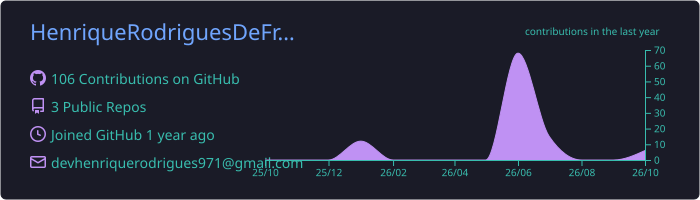
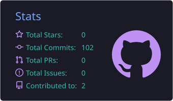
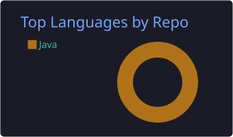
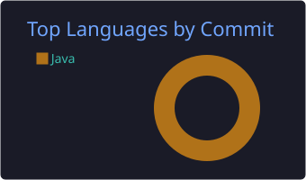

# Olá 👋, eu sou o Paulo Henrique

💻 **Desenvolvedor Backend Java em formação** · Estudante de Engenharia de Software
🇧🇷 São Paulo, Brasil

Foco em **APIs REST com Java e Spring Boot**, **testes automatizados** e **código limpo**. Construo projetos próprios para consolidar a base técnica e evoluir como desenvolvedor **Júnior / Estagiário**.

  
  

---

## 🧠 Sobre mim

- 🎓 Cursando Engenharia de Software
- ☕ Backend com **Java 21** e **Spring Boot** (Data JPA, Security)
- 🧪 Testes automatizados com **JUnit 5** e **Mockito**
- 🧱 Arquitetura em camadas (Controller / Service / Repository)
- 🗄️ **PostgreSQL** com versionamento de schema via **Flyway**
- 📄 APIs documentadas com **Springdoc/Swagger** e DTOs mapeados com **MapStruct**
- 🌐 Front básico (HTML, CSS e JavaScript) para consumir minhas próprias APIs

---

## 🛠️ Tecnologias

### Backend & Testes

### Banco de Dados

### Frontend

### Ferramentas

---

## 📌 Projetos em destaque

### 🛒 Frente de Caixa Online (Fullstack)
API REST em Spring Boot para vendas e controle de caixa, com persistência em PostgreSQL, migrações com Flyway e ampla cobertura de testes unitários.
**Stack:** Java · Spring Boot · PostgreSQL · Flyway · JUnit · Mockito
🔗 [Ver repositório](https://github.com/HenriqueRodriguesDeFreitas/NOME-DO-REPOSITORIO)

### 💸 ArenaPay (em documentação)
Plataforma de matchmaking e apostas de e-sports com **escrow**: o valor dos jogadores fica retido até a validação do resultado, com máquina de estados e transações simulando Pix via webhook/sandbox.
**Stack:** Java · Spring Boot · Spring Security · PostgreSQL · Flyway
🔗 [Ver repositório](https://github.com/HenriqueRodriguesDeFreitas/NOME-DO-REPOSITORIO)

### 🚗 Smart Parking Sensor (Web)
MVP de gerenciamento de vagas online que usa visão computacional básica para detectar o status das vagas pela variação de cor dos pixels.
🔗 [Ver repositório](https://github.com/HenriqueRodriguesDeFreitas/NOME-DO-REPOSITORIO)

### ⚔️ Blasphemous-like Demo (Java)
Jogo de plataforma 2D com **LibGDX**, voltado ao estudo de algoritmos de caminhos e IA de inimigos baseada em Teoria dos Grafos.
🔗 [Ver repositório](https://github.com/HenriqueRodriguesDeFreitas/NOME-DO-REPOSITORIO)

---

## 📊 Estatísticas do GitHub

  
  

  
  

---

## 🚀 Objetivo

> _"Evoluir como desenvolvedor backend Java, construindo APIs REST bem estruturadas, aplicando a cultura de testes e boas práticas e resolvendo problemas reais de negócio."_

---

🤝 Aberto a oportunidades de **estágio** ou **desenvolvedor júnior**
⭐ Fique à vontade para explorar meus repositórios
